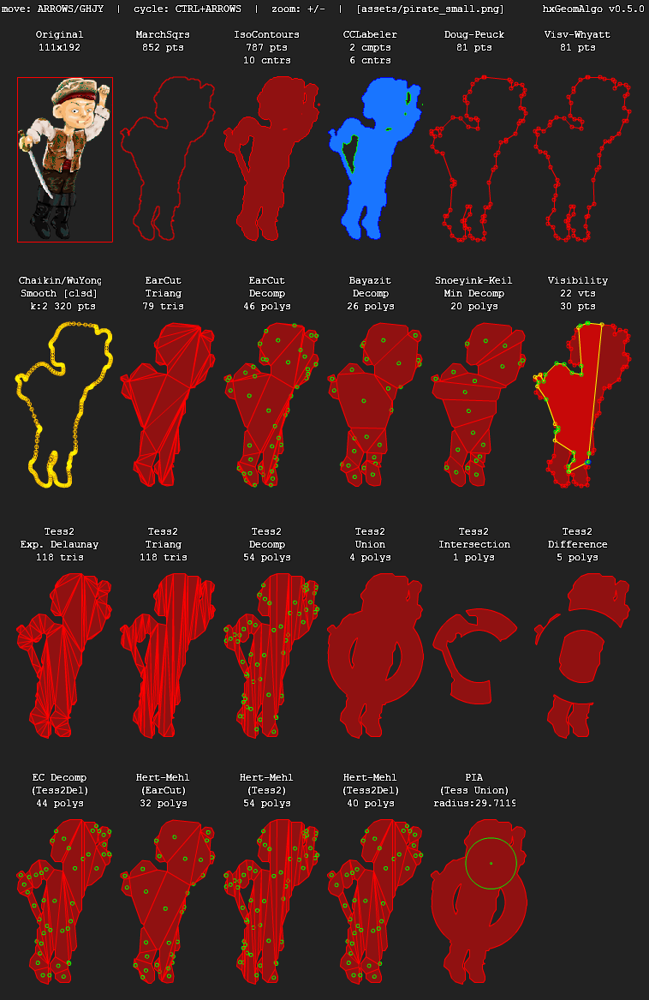

hxGeomAlgo
==========

Small collection of computational geometry algorithms in Haxe 3.3.

[swf demo](https://rawgithub.com/azrafe7/hxGeomAlgo/master/bin/flash/debug/bin/OpenflDemo.swf) | [js demo](https://rawgithub.com/azrafe7/hxGeomAlgo/master/bin/html5/final/bin/index.html)

#### [Marching Squares (Contour Tracing)](https://en.wikipedia.org/w/index.php?title=Marching_squares&oldid=342542650)

Based on:

 - http://devblog.phillipspiess.com/2010/02/23/better-know-an-algorithm-1-marching-squares/ (C# - by Phil Spiess)
 - http://www.tomgibara.com/computer-vision/marching-squares (Java - by Tom Gibara)

#### [Ramer-Douglas-Peucker (Polyline Simplification)](http://en.wikipedia.org/wiki/Ramer%E2%80%93Douglas%E2%80%93Peucker_algorithm)

Based on:

 - http://karthaus.nl/rdp/ (JS - by Marius Karthaus)
 - http://stackoverflow.com/questions/849211/shortest-distance-between-a-point-and-a-line-segment (JS - by Grumdrig)

#### [Ear Clipping (Triangulation and Poly Decomposition w/ Hole Support)](http://en.wikipedia.org/wiki/Ear_clipping#Ear_clipping_method)

Based on:

 - https://github.com/mapbox/earcut (JS - by Vladimir Agafonkin)
 - http://www.ewjordan.com/earClip/ (Java - by Eric Jordan)

#### [Bayazit (Poly Decomposition)](http://mnbayazit.com/406/overview)

Based on:

 - http://mnbayazit.com/406/bayazit (C - by Mark Bayazit)
 - http://www.dyn4j.org/ (Java - by William Bittle)

#### [Visibilty Polygon](http://en.wikipedia.org/wiki/Visibility_polygon) and [Homogeneous Coords (2D)](http://en.wikipedia.org/wiki/Homogeneous_coordinates)

Based on:

 - http://www.cs.ubc.ca/~snoeyink/demos/convdecomp/VPDemo.html (Java - by Jack Snoeyink)

#### [Snoeyink-Keil (Minimum Convex Decomposition)](http://www.cs.ubc.ca/~snoeyink/demos/convdecomp/MCDDemo.html)

Based on:

   - http://www.cs.ubc.ca/~snoeyink/demos/convdecomp/MCDDemo.html  (Java - by Jack Snoeyink & Mark Keil)
   - [J. Mark Keil](http://www.informatik.uni-trier.de/~ley/pers/hd/k/Keil:J=_Mark), [Jack Snoeyink](http://www.informatik.uni-trier.de/~ley/pers/hd/s/Snoeyink:Jack.html): On the Time Bound for Convex Decomposition of Simple Polygons. [Int. J. Comput. Geometry Appl. 12](http://www.informatik.uni-trier.de/~ley/db/journals/ijcga/ijcga12.html#KeilS02)(3): 181-192 (2002)

#### [Connected Components Labeling and Contour Tracing (w/ Hole Support)](http://en.wikipedia.org/wiki/Connected-component_labeling)

Based on:

 - Fu Chang, Chun-jen Chen, Chi-jen Lu: [A linear-time component-labeling algorithm using contour tracing technique](http://www.iis.sinica.edu.tw/papers/fchang/1362-F.pdf) (2004)

#### [Visvalingam-Whyatt (Polyline Simplification)](http://bost.ocks.org/mike/simplify/)

Based on:

 - Visvalingam M., Whyatt J. D.: [Line generalisation by repeated elimination of the smallest area](https://hydra.hull.ac.uk/resources/hull:8338) (1992)
 - http://bost.ocks.org/mike/simplify/ (JS - by Mike Bostock)
 - https://github.com/jonasmalacofilho/dheap (Haxe - by Jonas Malaco Filho)
 - http://en.wikipedia.org/wiki/Binary_heap (Binary (Min)Heap)

#### [Tess2 (Tesselation to Triangles and Convex Polygons, Poly Boolean Ops)](https://dl.dropboxusercontent.com/u/32864004/dev/FPDemo/tess2.js-demo/index.html)

Based on:

 - GLU Libtess (by Eric Veach, July 1994)
 - [tess2.js](https://github.com/memononen/tess2.js) (JS - by Mikko Mononen, Aug 2013)

#### [IsoContours (Contour Tracing)](https://en.wikipedia.org/wiki/Contour_line)

Based on:

 - http://en.wikipedia.org/wiki/Marching_squares
 - https://github.com/deltaluca/nape (Haxe - by Luca Deltodesco)
 - https://github.com/scikit-image/scikit-image	(Python - by scikit-image team)

#### [Hertel-Mehlhorn (Convex Polygons from Arbitrary Triangulation)](https://www8.cs.umu.se/kurser/TDBA77/VT06/algorithms/BOOK/BOOK5/NODE194.HTM)

Based on:

 - https://github.com/ivanfratric/polypartition (CPP - by Ivan Fratric)
 - http://www.philvaz.com/compgeom (by Phil Porvaznik)

## Dependencies
The only dependency is [hxPixels](https://github.com/azrafe7/hxPixels), and only for the algorithms needing access to pixels.

## Usage
Code is extensively doc-commented, and I tried my best to make it easy/intuitive to use.
You can also take a look at the demo for a quick overview on how to use the different classes.

## Credits

**hxGeomAlgo** is based on the work of many developers and it wouldn't exist if it weren't for them. See the [CREDITS](CREDITS.md) file for details.

## License

**hxGeomAlgo** is developed by Giuseppe Di Mauro (azrafe7) and released under the MIT license (except for `Tess2.hx`, which is licensed under SGI B 2.0). See the [LICENSE](LICENSE.md) file for details. 